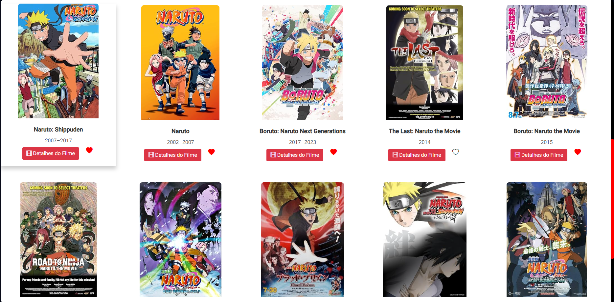
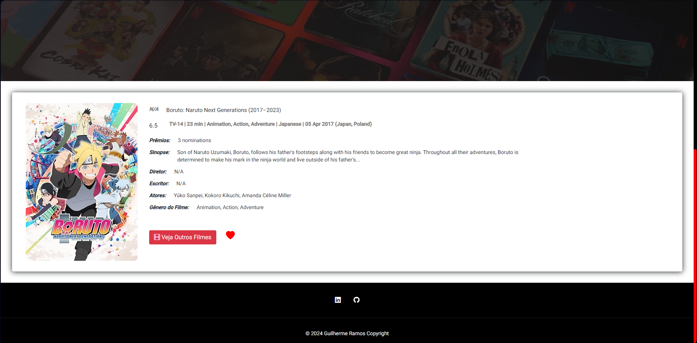
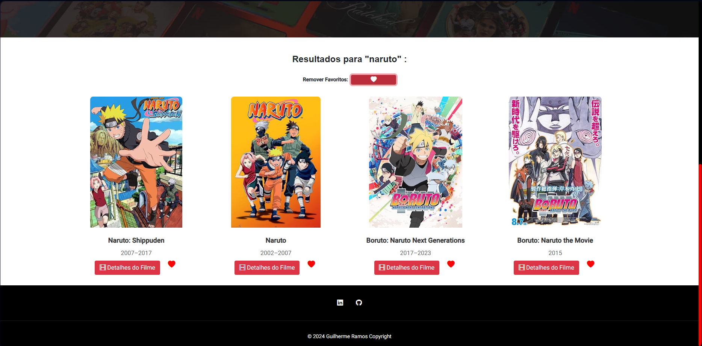

NTT MOVIES

Este é um projeto desenvolvido em Angular para a Academia NTT-DATA que utiliza a API OMDb para pesquisa e listagem de filmes.

Para iniciar o projeto localmente, siga estas etapas:

Clone o repositório para sua máquina local:

git clone https://github.com/GuilhermeJRamos/NTT-MOVIES.git

Navegue até o diretório do projeto:

cd NTT-MOVIES

Instale as dependências necessárias utilizando o npm:

npm install

Para iniciar o projeto localmente, siga estas etapas:

Dentro da pasta "src", crie um arquivo chamado ".env" com o seguinte conteúdo:

API_URL=https://www.omdbapi.com

API_KEY=INSIRA_AQUI_SUA_CHAVE_API

É essencial criar este arquivo, pois contém informações confidenciais necessárias para acessar a API. Sem isso, a chamada para a API não funcionará corretamente no ambiente local. O arquivo ".env" principal é ignorado pelo Git por razões de segurança, garantindo que suas credenciais não sejam expostas publicamente.

Certifique-se de substituir "INSIRA_AQUI_SUA_CHAVE_API" pela sua chave de API fornecida.

Inicie o servidor de desenvolvimento:

npm start
Após esses passos, o projeto estará disponível em http://localhost:4200/ no seu navegador padrão. Aproveite a experiência de navegar e buscar filmes!

Aqui estão algumas capturas de tela do projeto:

Página Inicial:

Listagem de Filmes:

Detalhes do Filme:

Aba de Favoritos:

